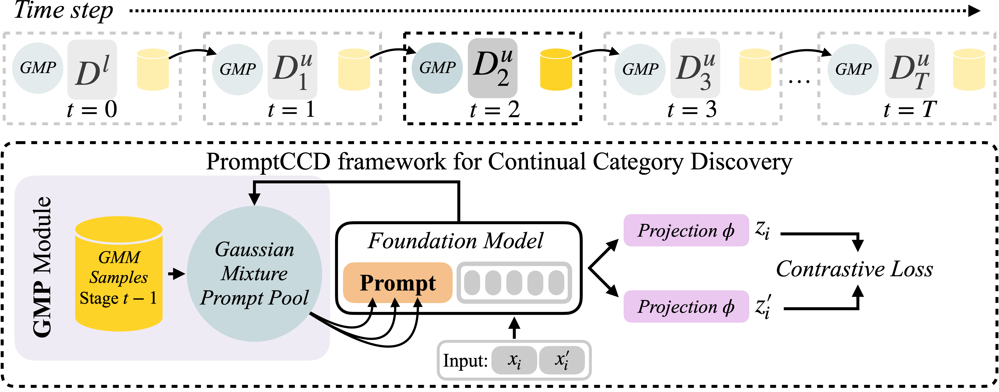

# PromptCCD: Learning Gaussian Mixture Prompt Pool for Continual Category Discovery [ECCV 2024]

[Fernando Julio Cendra](https://scholar.google.com/citations?user=cnChUoEAAAAJ&hl=en)<sup>1</sup>,
[Bingchen Zhao](https://bzhao.me)<sup>2</sup>, 
[Kai Han](https://www.kaihan.org/)<sup>1</sup>

<sup>1</sup>[Visual AI Lab](https://visailab.github.io/), The University of Hong Kong&nbsp;&nbsp;&nbsp;
<sup>2</sup>The University of Edinburgh

<a href="https://visual-ai.github.io/promptccd/"></a>
<a href="https://arxiv.org/abs/2407.19001"></a>

<center>

</center>

<p align="justify">
In Continual Category Discovery (CCD), the model receives the labelled set at the initial stage and is tasked to discover categories from the unlabelled data in the subsequent stages. There are two major challenges in CCD:

- **Category Discovery** for both known and novel categories in the unlabelled data.
- **Catastrophic forgetting**, a well-known issue in continual learning.

PromptCCD proposes a simple yet effective prompting framework for Continual Category Discovery (CCD). 
At the core of PromptCCD lies the Gaussian Mixture Prompting (GMP) module, which acts as a dynamic pool of prompts that updates over time to facilitate representation learning and prevent forgetting during category discovery by guiding foundation model with its prompt.
</p>

## Environment
The environment can be easily installed through [conda](https://docs.conda.io/projects/miniconda/en/latest/) and pip. After cloning this repository, run the following command:
```shell
$ conda create -n promptccd python=3.10
$ conda activate promptccd

$ pip install scipy scikit-learn seaborn tensorboard kmeans-pytorch tensorboard opencv-python tqdm pycave timm
$ conda install pytorch==2.1.2 torchvision==0.16.2 pytorch-cuda=12.1 -c pytorch -c nvidia
```

*After setting up the environment, it’s recommended to restart the kernel.

## Data & Setup
Please refer to [README-data.md](doc/README-data.md) for more information regarding how to prepare and structure the datasets.


## Training
Please refer to [README-config.md](doc/README-config.md) for more information regarding the model configuration.

The configuration files for training and testing can be access at `config/%DATASET%/*.yaml`, organized based on different training datasets, and prompt module type.
For example, to train **PromptCCD** ***w/*** **GMP** where C (*number of categories*) is known on CIFAR100, run:
```shell
$ CUDA_VISIBLE_DEVICES=%GPU_INDEX% python main.py \
--config "config/cifar100/cifar100_promptccd_w_gmp.yaml" \
--train
```
 The training script will generate a directory in `exp/%SAVE_PATH%` where `%SAVE_PATH%` can be specified in the `"configs/%DATASET%/*.yaml"` file. 
 All of the necessary outputs, e.g., training ckpt, learned gmm for each stage, and experiment results are stored inside the directory. 
 
 The file structure should be:
```
promptccd
├── config/
|   └── %DATASET%/
:       └── *.yaml (model configuration)
|
└── exp/
    └── %SAVE PATH%/
        ├── *.yaml (copied model configurations)
        ├── gmm/
        ├── model/ (training ckpt for each stage)
        ├── pred_labels/ (predicted labels from unlabelled images)
        ├── log_Kmeans_eval_stage_%STAGE%.txt
        └── log_SS-Kmeans_test_stage_%STAGE%_w_ccd_metrics.txt
```

## Testing
To replicate our results reported in the paper, copy the relative path of the `*.yaml` file stored in the `%SAVE_PATH%`, *i.e.*,  your saved training path and run:

```shell
$ CUDA_VISIBLE_DEVICES=%GPU_INDEX% python main.py \
--config "exp/%SAVE_PATH%/*.yaml" \
--test
```


## Acknowledgement
Our code is developed based on [GCD](https://github.com/sgvaze/generalized-category-discovery) and [GPC](https://github.com/DTennant/GPC) repositories.

## License

This project is under the CC BY-NC-SA 4.0 license. See [LICENSE](https://creativecommons.org/licenses/by-nc-sa/4.0/) for details.

## Citation
```bibtex
@inproceedings{cendra2024promptccd,
    author    = {Fernando Julio Cendra and Bingchen Zhao and Kai Han},
    title     = {PromptCCD: Learning Gaussian Mixture Prompt Pool for Continual Category Discovery},
    booktitle = {European Conference on Computer Vision},
    year      = {2024}
}
```
